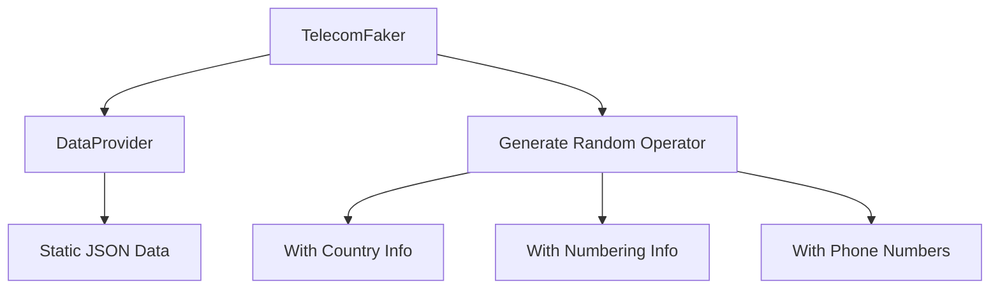

# TelecomFaker

A Python package for generating realistic telecom operator test data. Similar to Faker, but focused on telecom-specific information.

## Design



## Features

- Generate random telecom operator data with realistic information
- Access operator details by country, region, or randomly
- Get accurate numbering information (Prefix, MCC, MNC)
- Filter operators by size, country, or other attributes
- Built with real-world telecom data

## Installation

```bash
pip install telecomfaker
```

## Quick Start

```python
from telecomfaker import TelecomFaker

# Create a TelecomFaker instance
faker = TelecomFaker()

# Get a random operator with all associated information
result = faker.generate_operator(with_phone_number=True)
operator = result["operator"]
numbering = result["numbering"]
phone = result["phone_number"]

print(f"Random Operator: {operator['name']} ({operator['country']})")
print(f"MCC: {operator['mcc']}, MNC: {operator['mnc']}")
print(f"Size: {operator['size']} subscribers")
print(f"Country Code: {numbering['country_code']}")
print(f"Mobile Prefixes: {numbering['mobile_prefixes']}")
print(f"Sample Phone Number: {phone}")
```

## Data Sources

TelecomFaker uses real-world data compiled from:

- ITU (International Telecommunication Union)
- Public MCC/MNC databases
- Telecom regulatory authorities
- Open-source telecom data repositories

## Contributing

Contributions are welcome! Please feel free to submit a Pull Request.

## License

This project is licensed under the MIT License - see the LICENSE file for details.
